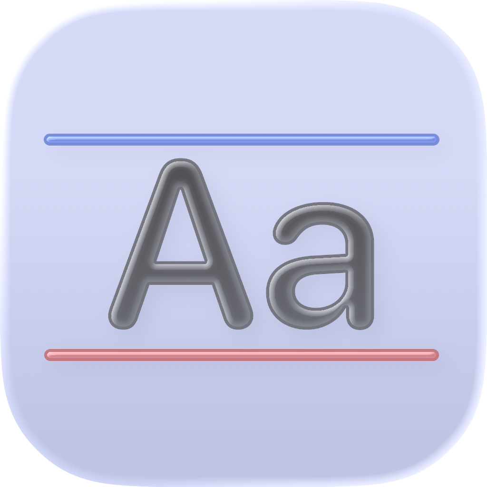
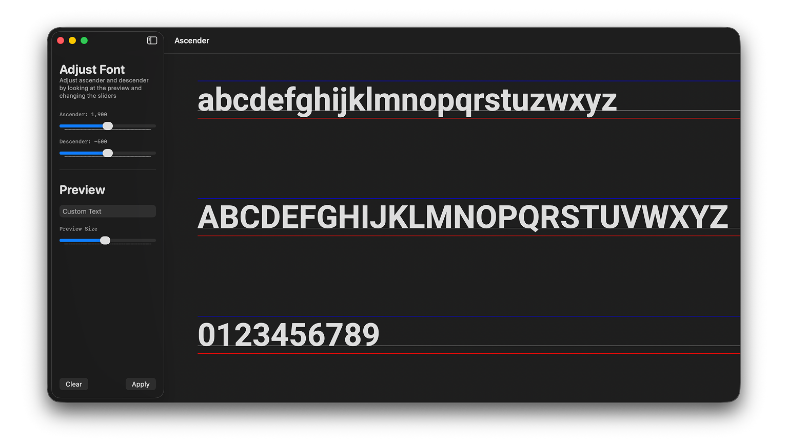

#  &nbsp;Ascender

A macOS tool for viewing and adjusting a fonts descender and descender.

This solves common font rendering problems when developing iOS applications. Thanks to Andy Yardley for the [original article](https://www.andyyardley.com/2012/04/24/custom-ios-fonts-and-how-to-fix-the-vertical-position-problem/).

---

## Requirements

- macOS
- [Apple Font Tools](https://developer.apple.com/fonts/) installed
  (part of the Apple Fonts package)

> Ascender relies on Apple’s font tooling

## Features

- Drag & drop `.ttf` / `.otf` fonts
- Visualises:
  - Ascender
  - Descender
- Live adjustment via sliders
- Preview custom text
- Exports a modified font using Apple Font Tools